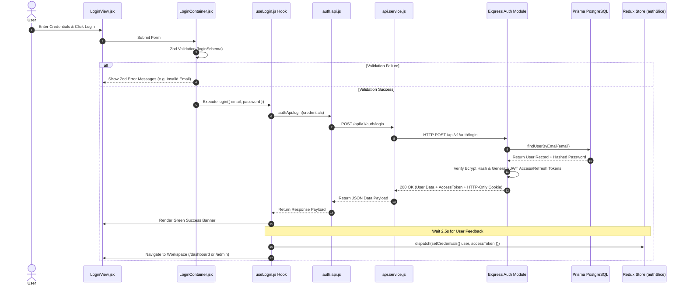

# 🔐 BrandFlow Login API — End-to-End Data Flow Architecture Guide

A dedicated architectural reference detailing the exact, step-by-step data flow of the **Login API (`POST /api/v1/auth/login`)** across the entire BrandFlow application—from user form input in the React UI, through Zod validation, TanStack Query mutations, Redux state dispatch, Axios HTTP interceptors, to backend Express handlers, Prisma database verification, and role-based navigation.

---

## 📌 Executive Overview

The login flow is engineered for **Security (JWT Access + Refresh Tokens)**, **Clean Layered Architecture (Container/Presentational)**, and **User Experience (Feedback banners & 2FA challenge handling)**.

### Technology Components Involved
- **UI & Form Management**: React Hook Form + Zod (`loginSchema`)
- **Container / View Layer**: `LoginContainer.jsx` & `LoginView.jsx`
- **Mutation & Server State**: TanStack Query (`useMutation`) via `useLogin.js`
- **Global App State**: Redux Toolkit (`authSlice.js` -> `setCredentials`)
- **HTTP Client**: Axios with `api.service.js` interceptors
- **Backend Stack**: Node.js + Express + Prisma ORM + PostgreSQL
- **Authentication**: Bcrypt password hashing + Short-lived JWT Access Token + HTTP-Only Refresh Cookie

---

## 🔄 1. High-Level ASCII Flowchart

```text
[ 1. User Enters Email & Password ]
                 │
                 ▼
[ 2. LoginView.jsx ] (Displays input fields & error feedback)
                 │
                 ▼
[ 3. LoginContainer.jsx ] (Triggers Zod Schema Validation)
                 │
                 ▼ (If Validation Passes)
[ 4. useLogin.js ] (Invokes TanStack Query useMutation)
                 │
                 ▼
[ 5. auth.api.js ] (Executes POST /api/v1/auth/login payload)
                 │
                 ▼
[ 6. api.service.js ] (Axios Instance forwards request with credentials: true)
                 │
                 ▼
[ 7. Backend auth.routes.js ] (Express validates body via getLoginSchema)
                 │
                 ▼
[ 8. Backend auth.controller.js & auth.logic.js ] (Bcrypt password check)
                 │
                 ▼
[ 9. Backend auth.repository.js & token.helper.js ] (Prisma DB lookup + Generate Tokens)
                 │
                 ▼ (Returns AccessToken in JSON & HTTP-Only Refresh Cookie)
[ 10. useLogin.js onSuccess Handler ] (Displays green success banner)
                 │
                 ▼ (After 2.5s Delay for User Feedback)
[ 11. Redux Dispatch ] (dispatch(setCredentials({ user, accessToken })))
                 │
                 ▼
[ 12. Workspace Redirect ] (Navigate to /admin/dashboard, /subadmin/dashboard, or /dashboard)
```

---

## 🌐 2. Mermaid Sequence Diagram



---

## 📂 3. Step-by-Step File-by-File Code Walkthrough

### Step 1: Routing & Guard Layer
- **File**: `frontend/src/routes/AppRoutes.jsx`
  - Maps route `/login` under `<PublicRoute />` and `<AuthLayout />`.
  - Dynamically imports `LoginPage` using `React.lazy()`.
- **File**: `frontend/src/features/auth/pages/LoginPage.jsx`
  - Renders `LoginForm.jsx`, which mounts `LoginContainer.jsx`.

---

### Step 2: Form Controller & Zod Validation Layer
- **File**: `frontend/src/features/auth/containers/LoginContainer.jsx`
  - Uses `react-hook-form` connected to Zod resolver:
    ```javascript
    const { register, handleSubmit, formState: { errors } } = useForm({
      resolver: zodResolver(loginSchema),
      defaultValues: { email: savedEmail, password: "", rememberMe: Boolean(savedEmail) }
    });
    ```
  - On submission: saves/removes `rememberedEmail` in `localStorage`, then calls `login(data)`.

- **File**: `frontend/src/validations/auth.validation.js`
  - Validates email format and non-empty password:
    ```javascript
    export const loginSchema = z.object({
      email: z.string().trim().email("Please enter a valid email address."),
      password: z.string().min(1, "Password is required."),
      rememberMe: z.boolean().optional(),
    });
    ```

---

### Step 3: Mutation Hook & Server State Layer
- **File**: `frontend/src/features/auth/hooks/useLogin.js`
  - Handles the asynchronous login mutation using TanStack Query:
    ```javascript
    export const useLogin = () => {
      const dispatch = useDispatch();
      const navigate = useNavigate();

      const mutation = useMutation({
        mutationFn: (credentials) => authApi.login(credentials),
        onSuccess: (response) => {
          const { require2FA, mfaToken, user, accessToken } = response.data;

          // 2FA Challenge Handling
          if (require2FA) {
            navigate('/verify-2fa', { state: { mfaToken }, replace: true });
            return;
          }

          // 1. Show Success Feedback Banner
          setSuccessMessage('🎉 Logged in successfully! Preparing workspace...');

          // 2. Wait 2.5s for user experience feedback
          setTimeout(() => {
            dispatch(setCredentials({ user, accessToken }));
            navigate(user.isSuperAdmin ? '/admin/dashboard' : '/dashboard');
          }, 2500);
        },
      });

      return { ...mutation, successMessage };
    };
    ```

---

### Step 4: API Service & HTTP Client Layer
- **File**: `frontend/src/services/auth.api.js`
  ```javascript
  export const authApi = {
    login: async (credentials) => {
      const response = await api.post(API_ENDPOINTS.AUTH.LOGIN, credentials);
      return response.data;
    },
  };
  ```

- **File**: `frontend/src/services/api.service.js`
  - Central Axios instance configured with `withCredentials: true` so HTTP-Only cookies (`refreshToken`) are sent securely.

---

### Step 5: Backend Request Execution Layer
- **Route** (`backend/src/modules/auth/auth.routes.js`):
  Matches `POST /api/v1/auth/login`, validates payload schema, calls `authController.login`.
- **Controller** (`backend/src/modules/auth/auth.controller.js`):
  Executes `authLogic.loginUser(req.body)` and sets HTTP-Only `refreshToken` cookie on `res`.
- **Logic** (`backend/src/modules/auth/auth.logic.js`):
  1. Finds user via `authRepository.findUserByEmail(email)`.
  2. Compares password hash using `bcrypt.compare(password, user.passwordHash)`.
  3. Checks 2FA status.
  4. Generates JWT `accessToken` (15m expiration) and `refreshToken` (7d expiration).
- **Repository** (`backend/src/modules/auth/auth.repository.js`):
  Executes Prisma ORM query to fetch user details and role flags (`isSuperAdmin`, `isSubAdmin`).

---

### Step 6: Redux Dispatch & Workspace Redirect Layer
- **File**: `frontend/src/store/slices/authSlice.js`
  - Receives `setCredentials({ user, accessToken })`.
  - Updates Redux state: `state.user = user`, `state.accessToken = accessToken`, `state.isAuthenticated = true`.
  - Persists `accessToken` and user object to `localStorage`.
- **Navigation**:
  - SuperAdmin / SubAdmin -> `/admin/dashboard`
  - Standard User -> `/dashboard`

---

## 📊 Summary Table of Data Responsibilities

| Layer | Primary File | Responsibilities |
| :--- | :--- | :--- |
| **UI Presentation** | `LoginView.jsx` | Renders input fields, error banners, and Google OAuth button. |
| **Form Management** | `LoginContainer.jsx` | Handles form submission, Zod validation, and remember email state. |
| **Mutation Hook** | `useLogin.js` | Manages 2.5s success banner delay, 2FA challenge redirect, and Redux dispatch. |
| **API Client** | `auth.api.js` & `api.service.js` | Performs HTTP POST request and handles credentials/cookies. |
| **Global State** | `authSlice.js` | Stores `user`, `accessToken`, and `isAuthenticated` flag in Redux. |
| **Backend Execution** | `auth.logic.js` & `auth.repository.js` | Bcrypt password check, JWT token creation, and PostgreSQL user lookup. |
